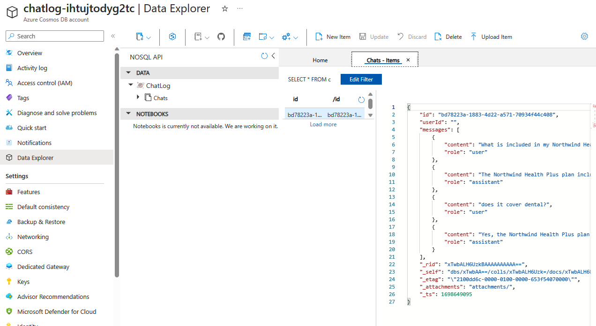

# Chat Logging (optional feature)

[This branch](https://github.com/leongj/azure-search-openai-demo/tree/chat-logging) (`chat-logging`) of my repo adds a feature that logs all chats to CosmosDB instance.

Thanks to `@danialtham_msft` for working with me on this one <3

## Steps
1. Install the main demo using this branch (e.g. `azd up`)
2. Run the `chatlogsetup.ps1` script (Powershell)

## How does it work?

The frontend creates a unique Id for each chat "thread" (e.g. refresh page, or click "Clear chat" button). The whole conversation is sent to the backend (A new API endpoint, `/chatlog`) as soon as the streaming response is completed. The data is upserted into the Cosmos container and is easily viewable.

The feature is enabled in app code, but is dormant if the value of `AZURE_COSMOS_ACCOUNT_NAME` is not set in the AZD environment.

The `chatlogsetup.ps1` script does the following:
1. Determine the unique id (i.e. `app-backend-<uniqueid>`) that is being used in the default AZD environment
2. Create a new CosmosDB account named `chatlog-<uniqueid>`, in the same resource group and location.
3. Create a database called `ChatLog` and container called `Chats`.
4. Save the variables to the AZD environment and add them to the AppService configuration as well.
5. Assign the **SQL role** `CosmosDB Built-in Data Contributor` to the AppService as well as the logged-in user.

The feature is enabled immediately

Chat logs look like this:

